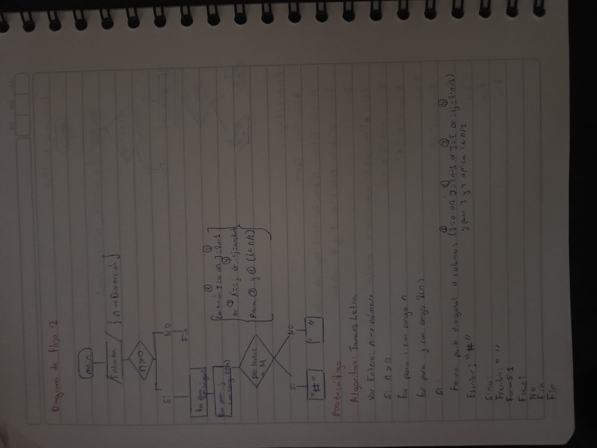
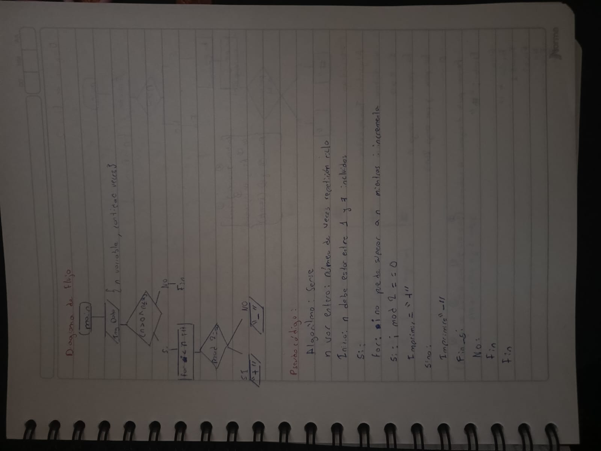
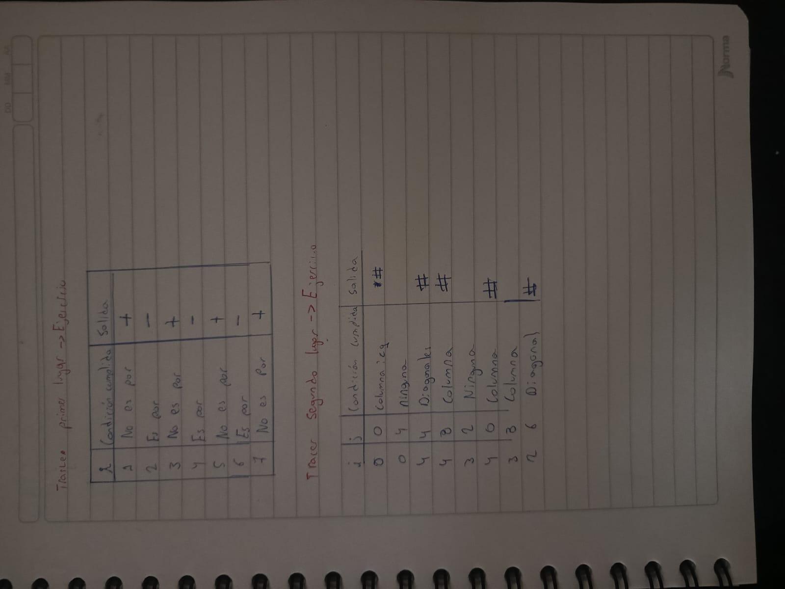
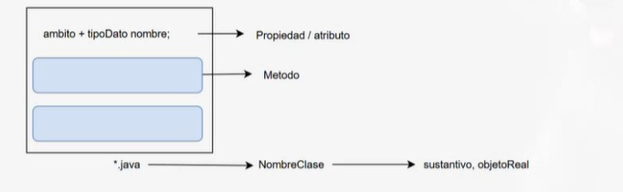

# Cuaderno de apuntes

## Class I: Intro a prog II - Terminal Git Bash

revisamos los comandos de linux

- Ls    : lista de archivos
- pwd   : me indica la ubicación actual
- extit : salir de la terminal
- ls -a : permite ver todo lo que hay ne una carpeta

## Class II: github

revisamos comandos de bash para directorios y terminal

- touch : crear archivos
- code  : abrir visual studio desde la terminal
- mkdir : crea una nueva carpeta
- "![nombre cualquiera]" (direccion de imagen)
- terminal del git personalizada ""
## Class III: IDE Integrado 

revisamos algunos comandos de: 
- Link [tipo buscador](direccion de navegador)"
-  git init: inicializar repositorio de gi en una carpeta
-  git status: Ver el estado actual del repositorio de Git
-  git add : agregar cambios al area de preparacion
-  git commit : guardar definitivamente los cambios en el repositorio de git 
-  git push : subir commits desde el repositorio local
-  git pull : traer cambios desde un repositorio remoto 
-  git rm : remueve el archivo
## Class IV Git + Github
-  mv : cambiar direccion del archivo 
-  chmod : cambiar archivo 
-  cp : copia de archivos o directorios
-  find : buscar archivos
-  grep : buscar un patron para archivos
-  vi : editar archivos usando editor de texto
-  cat : mostrar el contenido de archivos
-  tar : manipular documentos tipo tarball 
-  ps : mostrar informacion de proceso
-  kill : terminar proceso por envio 
-  top : mostrar proceso y el uso de recursos
-  ifconfig : configurar interfaces de red
-  ping : comprobar conectividad de red entre hosts
-  du : estimar el espacio utilizable
-  git ignore : omite los arhivos
-  git branch : usado para gestionar nuevas ramas (branches)
-  git switch : cambio de branches
-  src : source (fuente), utilizada mas para crear archivos de origen
-  git fetch : Descarga todo el historial del marcador del repositorio
## Class V: Deber I
- Establecimiento del proyecto y creación de clave SSH para pública y para privada
- empuje forzado mediante comandos de terminal 
- git pull  --force
- fix (para soluciones no tan inmediatas)
- hotfix  (para soluciones inmediatas)
- Git reset hard
- Git revert 
- Git checkout
- trabajo en rama
- source

## Class IV: Java
- Tipos de compilado 
- -Arquitectura de intepretado
- Tipos de Lenguaje
- Sintaxixs de Java
- Diseño de programas (UML)
- Libreria: conjuntos de clases
- Clase: código en específico con una función
- funcionamiento de paquetes y public class
- Diagramas de flujo 
- Trace : varaibles, operacion y salida por areas, computación secuencial
- en formación de tabla tipo matriz, no necesariamente con todos los datos llenos 
- Issue: No es un problema pero es más un error lógico 
- Error: Cuando el programa no arranca 
- Bug: Error no considerado en el programa que se quiere ejecutar

## Class IIV: FlujoGramas

- Algoritmia : Guiado tambíen a partir de el diagrama de Flujo
- Vision de Error en Tracer
- Estructura de un Diagrama de Flujo
- Src - Bin - Programa 
- Atajos de Teclado
- bloques

## Deber 1:

## Class IIIV : POO INTRO
- Indicaciones de código esquemático
- programación en serie de ejemplo
- acortación o simplificación de código
- uso módulo 
- Flujograma
- simbología geométrica
- leng: palabras reservadas
- pseudo-código
- código

## Class IX : Propiedades vs atributos
- trace
- Algorítmo
- salida de la terminal
- desarrollo por solución manual
- programas en plural pero usar singular
- significado camel case
- step by step, paso a paso, desarrollo
- atajo F5
- git init - inicio del proyecto 
- creación app.java
- proyectos (parecidos a bibliotecas)
- métodos (pueden ser varios en un mismo proyecto)
- App solo gestiona, como las funciones que solo se llama en el main
- para evitar aglumeración de código
- organización código 
- UML
- Directotio e gitignore
- Controlador, coordinadora de las demás
- App tiene el main 
- busca el Java JDK el método
- Arranca de App luego a Controlador para ordenar las clases 
- Delegación de responsabilidades
- Llamada en Java a controladores
- a veces puede haber más de un main 

- retorna valor: una función (int,string,etc...)
- no retorna valor: un procedimiento (void)
- public
- private
- protected
- diferencias entre comentar y documentar
- usar mas la documentación para el funcionamiento del programa no tan específicamente
- en lugar de utilizar la documentación usar los comentaros para debatir o sino también asignar nombres que no sean abreviaturas intuitivas (casos muy específicos)

## Class X : 

- Integer
- Tipo de dato
- Float
- Double
- espacios primitivos
- uso de conversores y escaners diferentes
- Inserción de datos explícita e Implícitamente

## Class XI : POO

-  Tipos de estructuras de programación 
- Método propiedad / atributo 
- Definir función
- Llamar función
- Pasar a la función como variable
- Estruvtura de flujo
- Programación asycron 
- Lectura en secuencia
- Avance de un proceso en un flujograma
- Ciclos repetitivos
- Secuencias de escape: 
- \t mover el cursor al siguiente tabulador
- \n salto de linea (enter)
- \r avanza lap rimer columna en el renglon actual
- \" imprime un literal que utiliza comilla doble
- \ ' imprime un literal que utiliza comilla sencilla
- \\ imprime una diagonal invertida
- Arrays
- para comparar strings usar .equalTo
-  crear package 
-  uso del Try 
-  uso del Catch
-  uso del charAt
-  Thread.sleep: Inyecta tiempo de procesamiento
-  uso del Repeat 
## Class XII :Poliretos
- Uso del apartado Watch 
- para avistamiento de variables
- uso del Java debug
- apartado de 7 u 8 simbolos utiles
- Uso del local 
- Rastreo de variables
- .toUpperCase : para evitar confusiones con las mayusculas y minusculas
- uso del .isDigit
- 
-

